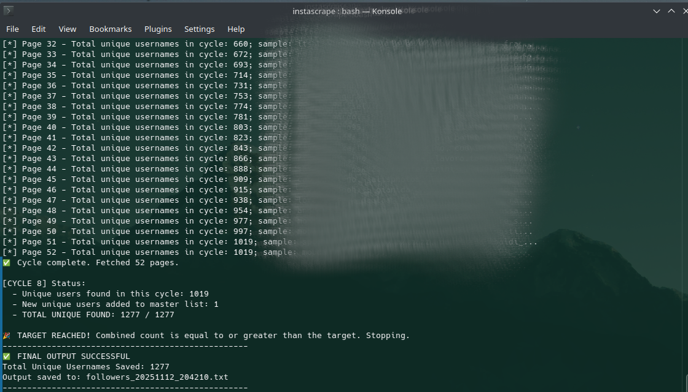

# follow_scraper: a tool to track your followers on IG

A simple script that scrapes all of your followers on instagram and stores them in a file. Once you run the script a second time, you are able to use diff.py and find who followed you or unfollowed you.

## Prerequisites

You need the Python package requests.

```sh
pip install requests
```

The script reads the HTTP request from request.txt and you need to capture your own request on your browser in developer mode, in the network tab. The request.txt file in the repo contains a mock request. Once you captured your own with your cookies, session IDs etc., you can launch the script.

## Usage

The script receives the number of followers as a command line argument. This is required by the scraper script in order to stop when the number is reached.

Generate the first snapshot of your followers (assuming they are 256):

```sh
python3 follow_scraper.py request.txt 256
```




Once you notice a change in your followers number, re-run the script. You may need to re-capture the HTTP request.

```sh
python3 follow_scraper.py request.txt 252
```

The two commands above generated two different snapshots, you are now able to check for their differences with:

```sh
python3 diff.py followers_2025111_235711.txt followers_20251212_124523.txt
```

```
----------------------------------------------------------------------
Follower Difference Report Generated: 2025-11-11 23:09:28
----------------------------------------------------------------------
Comparison Basis:
  - OLD Snapshot: followers_20251110_210905.txt (1271 followers)
  - NEW Snapshot: followers_20251111_213727.txt (1273 followers)
----------------------------------------------------------------------
SUMMARY OF CHANGES
------------------
Total Lost Followers (Unfollowed): 0
Total New Followers:             2
Net Change in Follower Count:    +2 (Total: 1273)
----------------------------------------------------------------------

LIST OF LOST FOLLOWERS (In OLD, Not in NEW):
----------------------------------------
N/A - No followers were lost.


LIST OF NEW FOLLOWERS (In NEW, Not in OLD):
----------------------------------------
someone1
someone2
```
